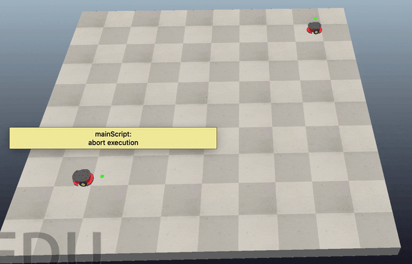

# Multiagent Avoidance

---

## Project Objectives
In a workspace resembling the [Basic-Motion-Planning](https://github.com/scalemailted/Basic-Motion-Planning) project, use two PioneerP3DX robots that are initialized at random states (orientations). One robot is currently situated at the starting position, while the other is at the goal location. The task is to create collision-free trajectories that enable the robots to exchange their initial positions while primarily adhering to the D* path.

---

## Motivations
In multiagent robotics, avoiding both static and moving obstacles is crucial. Static obstacles are avoided by planning paths that avoid stationary objects. In contrast, avoiding moving obstacles requires predicting their trajectory and anticipating their future movements. This is more challenging due to the uncertain and rapidly changing trajectory. Multiagent systems involve multiple agents interacting in real-time, which requires predicting their future movements and planning trajectories that avoid collisions while achieving the objective.

---

## Approach

### Static Obstacle Avoidance

#### Overview
Static obstacle avoidance involves planning a path from a start location to a goal location while avoiding stationary obstacles like walls, rocks, or other fixed objects. This approach is often used in robotics applications to ensure that the robot can safely navigate its environment without colliding with any obstacles.

#### D* Algorithm
One approach to static obstacle avoidance is to use the D* algorithm. This algorithm works by iteratively updating the path from the start to the goal as new obstacles are discovered. The algorithm uses a heuristic function to estimate the cost of the remaining path, which allows it to avoid areas with obstacles and find a safe path to the goal.

### Dynamic Obstacle Avoidance

#### Overview
Dynamic obstacle avoidance involves detecting and avoiding moving obstacles or agents, such as other robots or pedestrians. This approach is often used in multi-agent robotics applications to ensure that robots can navigate in real-time without colliding with each other or other moving objects.

#### Sensor-Based Approach
One approach to dynamic obstacle avoidance is to use sensors to detect the presence of other agents or obstacles. The robot can then maneuver to avoid the obstacle using a set of rules similar to the road rules of veering towards the right when the path ahead is clear, and continuing its movement. Once the obstacle is cleared, the robot can recorrect its course back onto the planned path. This approach is based on the principles of defensive driving and is commonly used in robotics applications.

---

## Key Features
TODO list the item features of thus porject

---

## Algorithmic Overview:
TODO breakdown the algorithm for this assignment

---

## Implementation: 

### *CoppeliaSim* 

**multiagent-avoidance.tt**
> TODO explain this version 

---

## Project Hierarchy 
- 📁 **assets/**
    + *contains all images in readme documentation*
- 📁 **coppeliasim/**
    + 📁 **scenes/**
        - *contains CoppeliaSim scenes (.tt)*
        - 📄 multiagent-avoidance.tt
    + 📁 **scripts/**
        - *contains associated Python scripts from the scene*
        - 📄 coppeliasim_random_sphere_selection.py